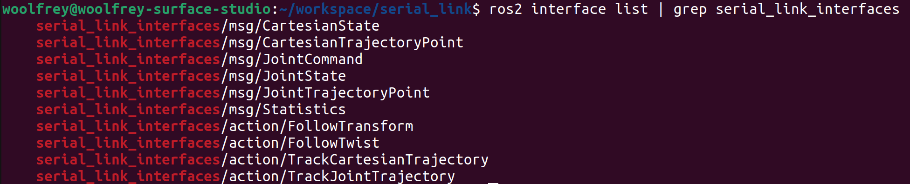
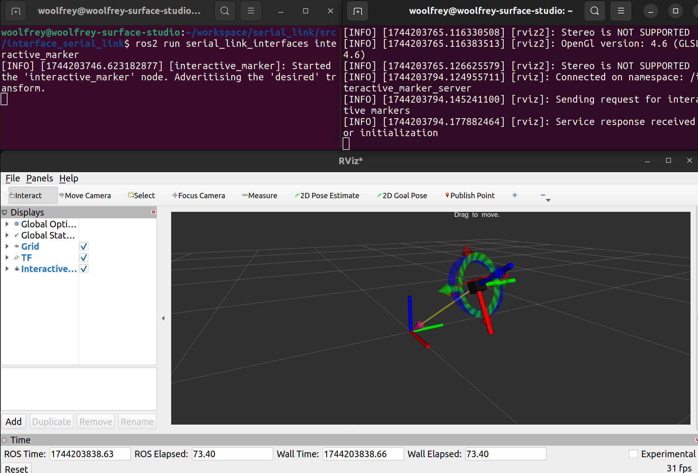
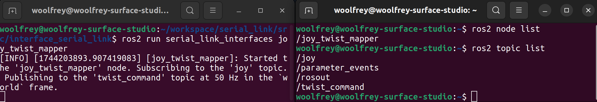

# :jigsaw: Serial Link Interfaces

This ROS2 package defines custom `.msg` and `.action` files for controlling serial link robot arms. The purpose is to establish standardised communication protocols between an action server (which manages the robot control) and an action client (which handles the high-level task planning). It was created to be used alongside the [serial link action server](https://github.com/Woolfrey/server_serial_link) and [serial link action client](https://github.com/Woolfrey/client_serial_link) ROS2 packages. These interfaces have been deliberately abstracted for seemless integration with other potential action servers and action clients.

#### :sparkles: Features:
- Message types for defining both joint, and Cartesian trajectories for robot control.
- Statistics messages for summarising robot performance.
- Action definitions for real-time feedback control.
- Nodes for manually controlling a robot.

#### :compass: Navigation
- [Requirements](#clipboard-requirements)
- [Installation](#floppy_disk-installation)
- [Usage](#wrench-usage)
- [Messages](#incoming_envelope-messages)
- [Actions](#cartwheeling-actions)
- [Nodes](#satellite-nodes)
- [Contributing](#handshake-contributing)
- [Citing this Repository](#bookmark_tabs-citing-this-repository)
- [License](#scroll-license)

## :clipboard: Requirements

I created, compiled, and tested this code using:

- [Ubuntu 22.04](https://ubuntu.com/blog/tag/22-04-lts), and
- [ROS2 Humble](https://docs.ros.org/en/humble/index.html).

## :floppy_disk: Installation

Your directory structure should end up looking something like this:
```
ros2_workspace/
├── build/
├── install/
├── log/
└── src/
    └── interface_serial_link
        ├── action/
        ├── msg/
        ├── src/
        ├── CMakeLists.txt
        ├── package.xml
        └── README.md
```

1. In your ROS2 workspace `<your_workspace>/src/` directory, clone the package:

```
git clone https://github.com/Woolfrey/interface_serial_link.git
```

> [!NOTE]
> The repository name is `interface_serial_link`, but the project name in the CMakeLists.txt and package.xml file is `serial_link_interfaces`. I did this deliberately so it's easier to sort through my repositories on github.

2. Navigate back to the root `<your_workspace>` and install:

```
colcon build --packages-select --serial_link_interfaces
```

3. Source the changes (if you haven't modified your `.bashrc` file):

```
source ./install/setup.bash
```

4. Validate the installation:

```
ros2 interface list
```

You should see the following:

<p align="center">
  
</p>

[:top: Back to Top.](#jigsaw-serial-link-interfaces)

## :wrench: Usage

To use the interfaces, you can include them in your `.h`, `.hpp`, and/or `.cpp` files:

```
#include <serial_link_interfaces/msg/joint_trajectory_point.hpp>
#include <serial_link_interfaces/action/track_joint_trajectory.hpp>
```

In your `CMakeLists.txt` file you must tell the compiler to find the package:
```
find_package(serial_link_interfaces REQUIRED)
```
and list them as dependencies in the `package.xml` file:
```
<build_depend>serial_link_interfaces</build_depend>
<exec_depend>serial_link_interfaces</exec_depend>
```

For more details on how to implement them, check out my:
- [ROS2 Tutorials](https://github.com/Woolfrey/tutorial_ros2) on how to create  subscribers & publishers, services, and action servers.
- [Serial link action server](https://github.com/Woolfrey/server_serial_link) package,
- [Serial link action client](https://github.com/Woolfrey/client_serial_link) package, and
- [Kuka iiwa14 ROS2 velocity control](https://github.com/Woolfrey/control_kuka_velocity) package which implements both of these.

After installation, you can find out the details of any `msg`, `srv`, or `action` using, for example:
```
ros2 interface showal_link_interfaces/msg/Statistics
```
which brings up the fields:
```
float64 mean 0.0                        # Expected value (average)
float64 min  0.0                        # Lowest observed value
float64 max  0.0                        # Largest observed value
float64 variance 0.0                    # Average squared distance from mean
```
You could also just inspect the code :eyes:

Below are lists of `msg` and `action` files and their intended usage.

[:top: Back to Top.](#jigsaw-serial-link-interfaces)

## :incoming_envelope: Messages

| Message | Purpose |
|---------|---------|
| CartesianState | The current pose, velocity, and acceleration for the endpoint of a robot arm. |
| CartesianTrajectoryPoint | A series of poses & times from which a CartesianTrajectory is constructed. |
| JointCommand | An array of control inputs for the joints on a robot; position, velocity, or torque. |
| JointState | The position, velocity, and acceleration for the joints of a robot (either desired, or actual). |
| JointTrajectoryPoint | A series of joint states & times from which a joint trajectory is constructed. |
| Statistics | Summarises the control performance of an action with mean, min, max, and variance. | 

[:top: Back to Top.](#jigsaw-serial-link-interfaces)

## :cartwheeling: Actions

| Action | Purpose |
|---------|---------|
| FollowTransform | Tells the action server to listen to a `tf2::Transform` to make the endpoint of a robot arm follow it in real-time. |
| FollowTwist | Tells the action server the name of a topic for a `geometry_msgs::msg::TwistStamped` to control the endpoint of a robot in real-time. |
| TrackCartesianTrajectory | Given an array of `CartesianTrajectoryPoint`, create a Cartesian trajectory and perform feedback control to follow it with the endpoint of a robot arm. |
| TrackJointTrajectory | Given an array of `JointTrajectoryPoint`, create a (joint) trajectory and perform feedback control to follow it. |

[:top: Back to Top.](#jigsaw-serial-link-interfaces)

## :satellite: Nodes

This package also has nodes that facilitate interaction with a robot.

### Interactive Marker

If you run:
```
ros2 run serial_link_interfaces interactive_marker
```
a node will launch that advertised a `tf2_ros::Transform`. You can use this for your robot to follow, as per the `FollowTransform` action.

In another terminal, if you run:
```
ros2 run rviz2 rviz2
```
you can add the `TF` and `Interactive Marker` messages and you will be able to move it around with your mouse:

<p align="center">
    
</p>

You can set the parameters by launching with a YAML file:
```
/**:
  ros__parameters:
    interactive_marker:
      frame_id: "world"
      name: "desired"
      description: "Drag to move."
      scale: 0.2

      marker:
        scale: [0.05, 0.05, 0.05]
        color: [0.1, 0.1, 0.1, 1.0]
```

### Joy-Twist Mapper

This node converts a `sensor_msgs::msg::Joy` topic to a `geometry_msgs::msg::TwistStamped` message. This is useful for the `FollowTwist` action so you can manually control the robot with a gamepad or joystick :joystick:.

Use:
```
ros2 run serial_link_interfaces joy_twist_mapper
```
to launch the node.

<p align="center">
    
</p>

Again, you can load a YAML file when you run/launch the node:

```
/**:
  ros__parameters:
    joy_twist_map:
      frame_name: "world"
      max_angular_acceleration: 0.25
      max_angular_velocity: 0.1
      max_linear_acceleration: 1.0
      max_linear_velocity: 0.2
      timeout: 0.5

      subscription_name: "joy"
      publisher_name: "twist_command"
      publisher_frequency: 20

      default:
        axis:
          linear_x: -1
          linear_y: -1
          linear_z: -1
          angular_x: -1
          angular_y: -1
          angular_z: -1

        button:
          positive:
            linear_x: -1
            linear_y: -1
            linear_z: -1
            angular_x: -1
            angular_y: -1
            angular_z: -1
          negative:
            linear_x: -1
            linear_y: -1
            linear_z: -1
            angular_x: -1
            angular_y: -1
            angular_z: -1
```

Just change the `-1` to whatever axis or button index you want to control.

[:top: Back to Top.](#jigsaw-serial-link-interfaces)

## :handshake: Contributing

Contributions to this repositore are welcome! Feel free to:
1. Fork the repository,
2. Implement your changes / improvements, then
3. Issue a pull request.

If you're looking for ideas, you can always check the [Issues tab](https://github.com/Woolfrey/interface_serial_link/issues) for those with :raising_hand: [OPEN]. These are things I'd like to implement, but don't have time for. It'd be much appreciated, and you'll be tagged as a contributor :sunglasses:

[:top: Back to Top.](#jigsaw-serial-link-interfaces)

## :bookmark_tabs: Citing this Repository

If you find this code useful, spread the word by acknowledging it. Click on `Cite this repository` under the **About** section in the top-right corner of this page :arrow_upper_right:.

Here's a BibTeX reference:
```
@software{woolfrey_serial_link_interfaces_2025,
     author  = {Woolfrey, Jon},
     month   = apr,
     title   = {{S}erial {L}ink {I}nterfaces},
     url     = {https://github.com/Woolfrey/interface_serial_link},
     version = {1.0.0},
     year    = {2025}
}
```
Here's the automatically generated APA format:
```
Woolfrey, J. (2025). Serial Link Interfaces (Version 1.0.0). Retrieved from https://github.com/Woolfrey/interface_serial_link
```

[:top: Back to Top.](#jigsaw-serial-link-interfaces)

## :scroll: License

This software package is licensed under the [GNU General Public License v3.0 (GPL-3.0)](https://choosealicense.com/licenses/gpl-3.0/). You are free to use, modify, and distribute this package, provided that any modified versions also comply with the GPL-3.0 license. All modified versions must make the source code available and be licensed under GPL-3.0. The license also ensures that the software remains free and prohibits the use of proprietary restrictions such as Digital Rights Management (DRM) and patent claims. For more details, please refer to the [full license text](LICENSE).

[:top: Back to Top.](#jigsaw-serial-link-interfaces)
